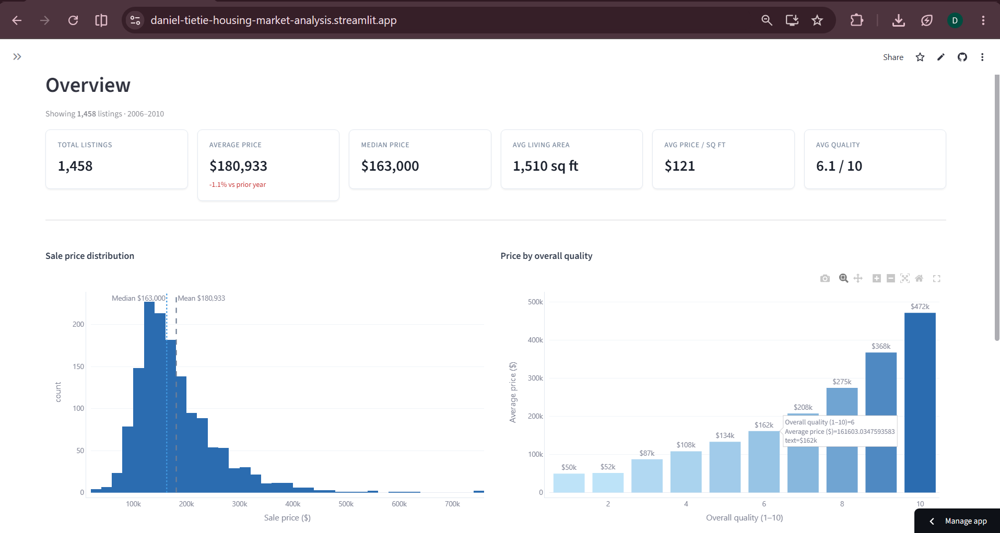
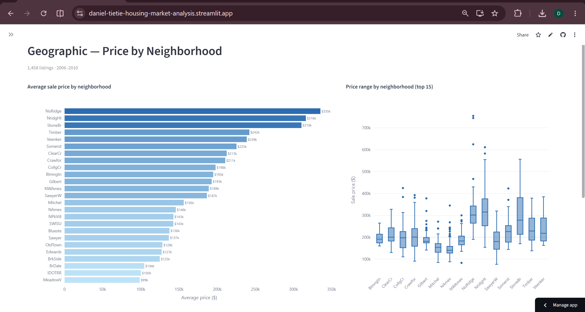
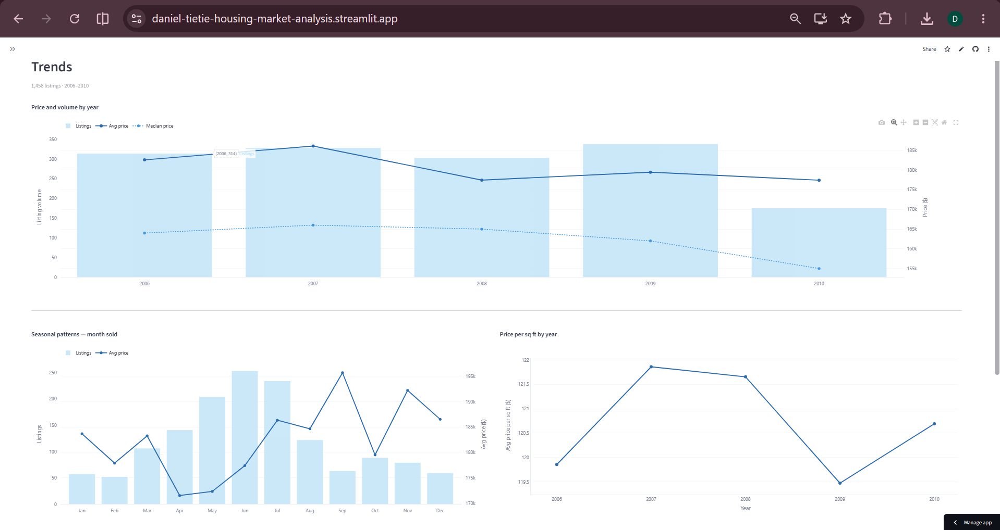
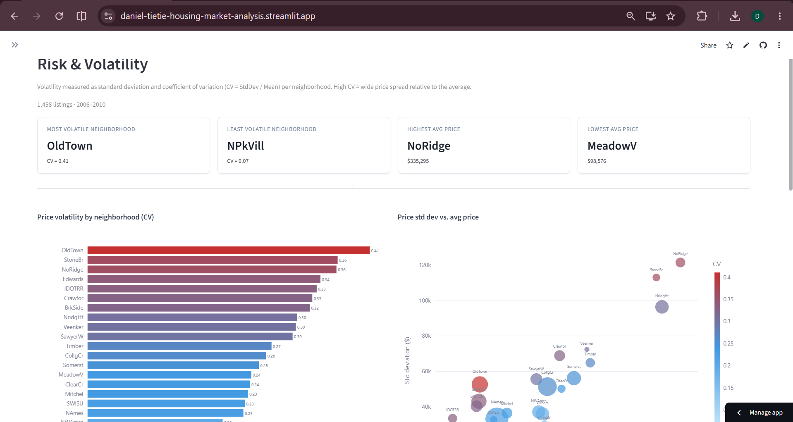

# Housing Market Analysis

------------------------------------------------------------------
### Live demo

[https://daniel-tietie-housing-market-analysis.streamlit.app/](https://daniel-tietie-housing-market-analysis.streamlit.app/)

**Note:** the dashboard is styled for light mode.So it's a bit wonky in darkmode.  If your browser/Streamlit theme defaults to dark mode, switch to light mode (Settings menu, top-right ⋮ in the app) for best viewing experience.

-------------------------------------------------------------------

An end-to-end data analytics and machine learning project built on the Ames Housing dataset: data ingestion, SQL storage and querying, exploratory analysis, predictive modeling, and an interactive dashboard. Built to demonstrate a complete pipeline end to end, from raw data to a working dashboard, for a data engineering and analytics portfolio.

## Data source and methodology

**Dataset:** Ames Housing, compiled by Dean De Cock (2011). 2,919 residential property sales in Ames, Iowa from 2006 to 2010, with 79 explanatory features covering lot characteristics, construction quality, interior area, and sale conditions.

**Source:** OpenML dataset ID 42165, fetched programmatically via scikit-learn's `fetch_openml`. No manual download required; run `python src/ingest.py` to reproduce from scratch.

**Why Ames, not a Canadian dataset:** CREA and CMHC publish aggregate price indices, not individual property records. Without individual-level data, meaningful ML modeling (feature importance, train/test evaluation) isn't possible. Ames is an established academic benchmark dataset suitable for demonstrating the full analytics pipeline.

**Storage:** SQLite local database (`data/housing.db`) with two tables: `raw_housing` (original data, unmodified) and `clean_housing` (analysis-ready, produced by `src/clean.py`).

## Key findings

- Neighborhood is the largest price determinant: average prices range from $99k (MeadowV) to $335k (NoRidge), a 3.4x spread within the same city.
- Overall quality rating (1-10) has the strongest single-feature correlation with price (r = 0.80). Each quality step above 6 adds roughly $40-50k to the average sale price, accelerating sharply at 9-10.
- Sale volume dropped significantly in 2010 following the 2008 financial crisis, but average prices in Ames held relatively stable (less than 5% decline), suggesting the local market was insulated from the national correction.
- The spring buying season is pronounced: May and June account for over 30% of annual transactions, but average prices don't meaningfully differ by month; timing affects volume, not price.
- Gradient Boosting outperformed linear regression with a test RMSE of approximately $25,000 and R² of 0.89, versus the baseline's RMSE of ~$40,000 and R² of 0.77. The model is reliable for homes in the $100k-$350k range; predictions above $400k are systematically low due to limited training examples.

## Dashboard

The dashboard is built with Streamlit and Plotly (`streamlit_app/app.py`), reading live from `data/housing.db`.

Four pages:

1. **Overview** — total listings, average and median price, price distribution, price by quality, price/volume by year, building type mix
2. **Geographic** — average price by neighborhood, price range by neighborhood, quality vs. price scatter, full neighborhood summary table
3. **Trends** — price and volume by year, seasonal patterns by month, price per sq ft by year, price by decade built
4. **Risk & Volatility** — price volatility (coefficient of variation) by neighborhood, std dev vs. average price, min/max price range, full risk table

### Screenshots






## Tech stack

- Python 3.11, pandas, numpy, scikit-learn, matplotlib, seaborn, plotly
- SQLite (via Python's built-in `sqlite3`)
- Streamlit (interactive dashboard)

## Repository structure

```
housing-market-analysis/
  data/
    raw/              original CSV (reproduced by ingest.py)
    processed/        cleaned CSV (reproduced by clean.py)
    housing.db        SQLite database (committed for dashboard deployment)
  sql/
    schema.sql        table definitions
    queries.sql       analytical SQL queries used in the EDA notebook
  notebooks/
    01_data_cleaning.ipynb
    02_exploratory_analysis.ipynb
    03_modeling.ipynb
  src/
    ingest.py         fetch from OpenML, load into SQLite
    clean.py          cleaning and feature engineering
    features.py       feature matrix preparation for ML
    model.py          model training and evaluation
  dashboard/
    screenshots/
  streamlit_app/
    app.py
  requirements.txt
  .gitignore
```

## How to run locally

```bash
git clone https://github.com/Daniel-Tietie/housing-market-analysis.git
cd housing-market-analysis

python -m venv venv
# Windows:
venv\Scripts\activate
# macOS/Linux:
source venv/bin/activate

pip install -r requirements.txt
# data/housing.db is already included in the repo, so the steps below are
# optional and only needed to reproduce the database from scratch.
python src/ingest.py
python src/clean.py

# Run the notebooks in order (requires Jupyter)
jupyter notebook notebooks/

# Or launch the Streamlit app
streamlit run streamlit_app/app.py
```

`data/housing.db` is committed to the repo so the dashboard works immediately after cloning. The `ingest.py` and `clean.py` steps above can regenerate it from scratch if needed.
